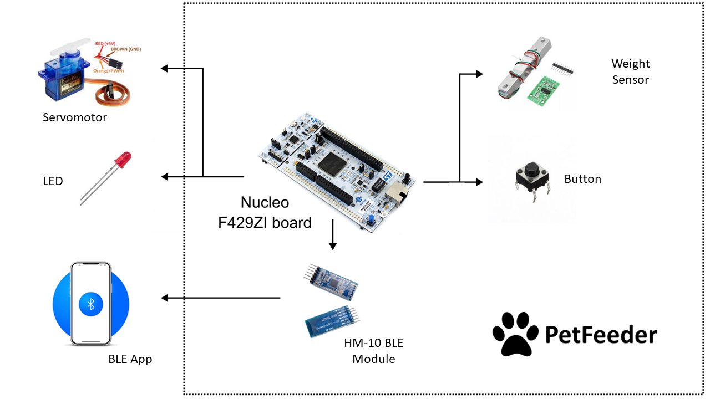
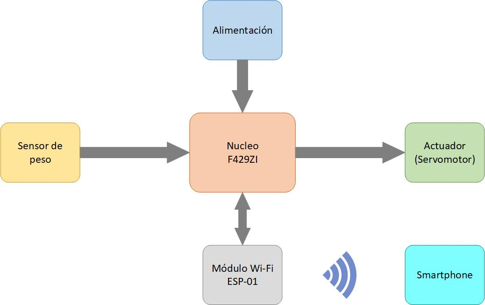
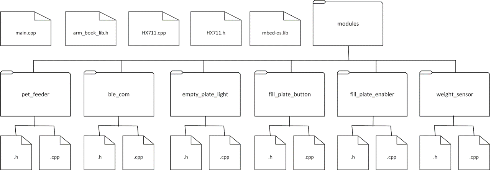
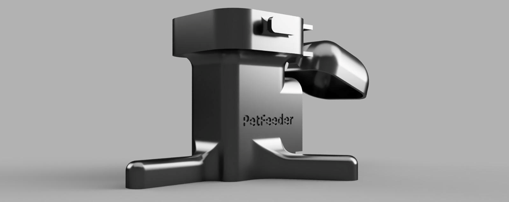

# PetFeeder

    

PetFeeder is a remote pet feeder system. This system notifies the user when the plate is empty and allows its filling with a portion that is a configurable parameter. This can be done with a button or using a smartphone.

For the development of this work, a NUCLEO-F429ZI board was used. It was programmed in C++ using Keil Studio Cloud IDE and Mbed operating system.

    

This work was carried out as part of the Embedded Systems course in the Faculty of Engineering of the University of Buenos Aires. The design, implementation, testing and documentation took me 4 weeks working on it part time.

**Video summary (English):** [Youtube](https://youtu.be/gjbgVhxkutw)

**Video Demo (Spanish):** [Youtube](https://www.youtube.com/watch?v=UbiIuWud2UA)

**Summary (Spanish):** [PDF](https://github.com/UlisesMontenegro/PetFeeder/blob/master/Summary.pdf)

# Description

The main functionality of the PetFeeder is to fill a plate with food for a pet remotely. This gives comfort to the user by reducing the amount of times he/she needs to fill the plate. It can also be useful for controlling the amount of food that the pet eats.

The system has the capability to store several portions of food in a 5 L container. When the plate is empty, a LED is turned on and the user is notified in him/her smartphone via BLE (Bluetooth Low Energy). The plate weight and the food portion are parameteres configurables by the user through the smartphone. Using a scale, the system senses the weight of the plate and, comparing with the parameteres mentioned, knows when the plate is empty and when it is full.

PetFeeder stands out from other similar products because the other are focused in filling the plate automatically following a schedule, while PetFeeder notifies the user when the plate is empty and is the user who allows the plate filling.

# Block Diagram

    

# File System

    

# BOM 

* NUCLEO-F429ZI Board.
* Weight Sensor + HX711 Module (Amplifier + AD Converter).
* HM-10 Module (BLE).
* Servomotor SG90.
* Button.
* LED.
* 1 KΩ resistor.
* 3D printed support.

**3D printed support:**

    

